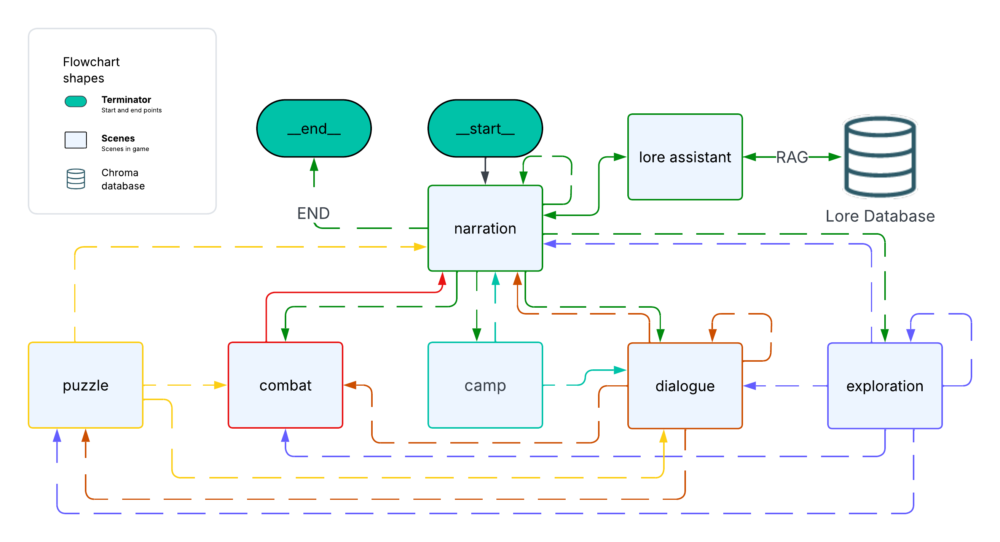

# 🐉 Neurons & Dragons

**Neurons & Dragons** is a minimal text-based RPG powered by AI and [LangGraph](https://github.com/langchain-ai/langgraph).  
It combines the creativity of large language models with a simple graph-driven game flow — a fusion of *neurons* and *dragons*.

---

## 🎮 Overview

- **LangGraph** for managing state and scene flow.
- **OpenAI model** for dynamic scene narration.

Each turn, the AI acts as your **Dungeon Master**, describing scenes and offering choices.  
Your selections shape the world — and the story continues until you decide to quit.

---

## Graph schema

<div style="display: flex; justify-content: center;">
  
</div>


---

## 🚀 Quick Start

### 1. Clone the repository
```bash
git clone https://github.com/michalwegiel/NeuronsAndDragons.git
```

### 2. Install dependencies
```bash
pip install -r requirements.txt
```

### 3. Add .env file with openai API key
```
OPENAI_API_KEY=123456789
```

### 4. Run the game
```bash
python main.py
```

Created by **Michal Wegiel** as a small experiment in combining **AI storytelling** with graph-based logic.